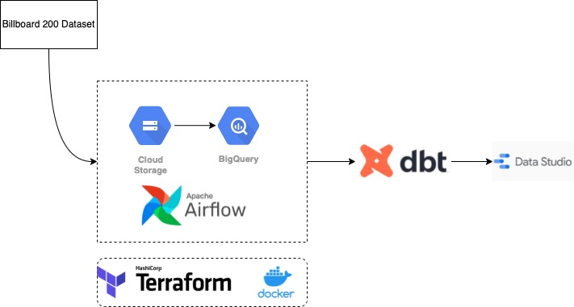

# Record Chart Pipeline

## Problem statement
The purpose of this project is to build an end-to-end data pipeline and to find insights about the music industry by exploring the Billboard 200 dataset. The Billboard 200 is a record chart that ranks 200 popular music albums and EPs in the U.S. This dataset is available in the form of a SQLite database file with 3 tables:
* `acoustic_features`
* `albums`
* `segments`

These 3 tables contain various track- and album-related data, including values for the Spotify EchoNest acoustic data. The dataset and its descriptions can be found here: https://components.one/datasets/billboard-200-with-segments

## Overall procedure

1. Build infrastructure on GCP via Terraform
2. Workflow orchestration via Airflow
   * Batch data ingestion into Cloud Storage
   * Partition and cluster tables into BigQuery
3. Data transformation via dbt
4. Create dashboard via Data Studio

## GCP setup
1. Create a [GCP account](https://console.cloud.google.com/freetrial) (free trial)
2. Create a new project
   * Give a descriptive name
   * Press the "EDIT" button
   * Keep the "Project ID" as is or change it appropriately; note this down
3. Create a [service account](https://cloud.google.com/docs/authentication/getting-started#create-service-account-console)
   * Grant `Viewer` role
   * Create a new private key; choose the JSON option and auth file will be downloaded automatically
   * Download [Cloud SDK](https://cloud.google.com/sdk/docs/install-sdk)
4. Grant additional permissions for the project
   * Go to [IAM & Admin](https://console.cloud.google.com/iam-admin/iam)
   * Edit principal for the service account
   * Add the following roles: `Storage Admin`, `Storage Object Admin`, and `BigQuery Admin`
5. Enable the following APIs:
   * [Identity and Access Management (IAM) API](https://console.cloud.google.com/apis/library/iam.googleapis.com)
   * [IAM Service Account Credentials API](https://console.cloud.google.com/apis/library/iamcredentials.googleapis.com)
6. Set the environment variable to the downloaded GCP service account key:
   ```shell
   export GOOGLE_APPLICATION_CREDENTIALS="<path/to/your/service-account-key>.json"

   # To verifty authentication
   gcloud auth application-default login
   ```

## Terraform
Refer to [README.md](/terraform/README.md) in the terraform directory.

## Airflow
Refer to [README.md](/airflow/README.md) in the airflow directory.

## dbt
Refer to [README.md](/dbt/README.md) in the dbt directory.

## Dashboard
[Data Studio](https://datastudio.google.com/reporting/42d0dce0-87a6-4dde-a6cc-dbf7b0558402)

## To
- [ ] Setup CI/CD
- [ ] Deploy BigQuery ML